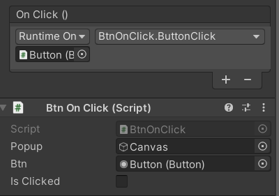

1. UI → Button 생성
2. Button Click 이벤트 생성하기
    - Script
        
        ```csharp
        using System.Collections;
        using System.Collections.Generic;
        using UnityEngine;
        using UnityEngine.UI;
        
        public class BtnOnClick : MonoBehaviour
        {
            public GameObject popup;
            public Button btn;
        
            public bool isClicked = false;
            
            public void ButtonClick(){
                isClicked = true;
                if(isClicked){
                    Debug.Log("Close");
                    popup.SetActive(false);
                }
            }
        }
        ```
        
    - Unity Inspector
        
        
