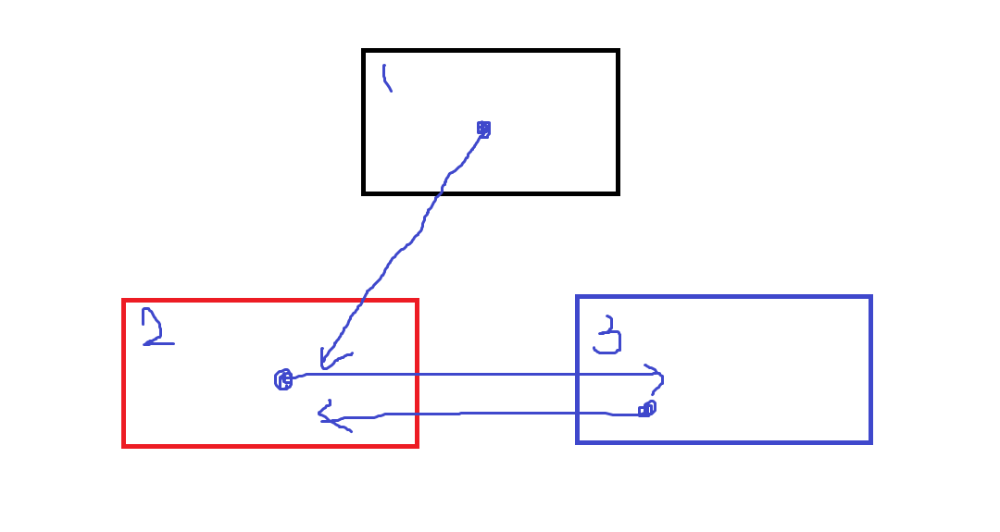

1. DontDestroyOnLoad 메소드 활용
    
    
    
    - 1번 씬에 오브젝트를 두고, 이 오브젝트를 2번 씬, 3번 씬에 계속 가지고 다님
    - 1번 씬은 다시 되돌아갈 일이 없는 씬
        - 다시 되돌아갈 경우 새로 GameObject가 또 생성되어 같은 Object가 두개 발생
        

    ex) 화면 전환 스크립트 -> [전체 코드](./DontDestroy.cs)

    ```csharp
    public void SceneChange()
        {
            nowButton = EventSystem.current.currentSelectedGameObject.name;
            if (nowButton == "CreateAvatar")
            {
                Debug.Log("아바타생성");
                DontDestroyOnLoad(GameObject.Find("PlayerArmature"));
                SceneManager.LoadScene("MainScene");
            }
        }
    ```
