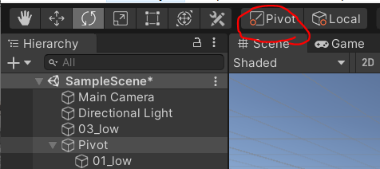
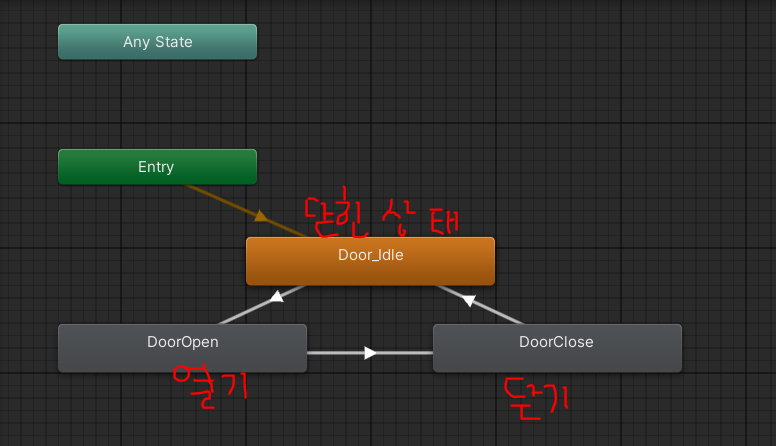
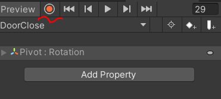

## Unity 3D - 문 열기 구현 방법

1. Pivot 만들기

   1. Create Empty 후 경칩이 될 기준을 잡아놓기

   2. Pivot의 자식으로 열려질 문을 넣기

   3. Toggle bar에서 Center → Pivot으로 변경

      

   <br/>

2. Pivot에 Box Collider 추가

   1. 캐릭터가 들어오면 자동으로 문을 열어줄 수 있도록 zone을 만들어줌
   2. IsTrigger에 check

   <br/>

3. Pivot에 Animation 추가

   1. Animation 폴더 만들기

   2. Add Property → Rotation 을 통해 Open과 Close 만들기 (참고 영상 7:46 부터)

      1. 시작 포지션과 끝 포지션이 0인, 문이 정지되어 있는 애니메이션 (닫혀 있는 채로 정지된)
      2. 시작 포지션은 y축이 0, 끝 포지션은 y축이 -90인 열리는 애니메이션
      3. 시작 포지션은 y축이 -90, 끝 포지션은 0인 닫히는 애니메이션
      4. 위 세개를 클립으로 만들기

      +) 참고 : Postion을 지정하기 전 녹화버튼 누르고 지정 후 녹화버튼 한번 더 눌러야 저장됨

      

   3. Animator 창에서 Animation 순서 지정하기

      

   <br/>

4. Trigger 추가

   1. Parameters에서 Open, Close 라는 이름의 두 개의 Trigger를 추가
   2. 닫힌 상태에서 열기로 뻗어져 있는 Transition에 Condition을 추가 (Open)
   3. 열기에서 닫기로 뻗어져있는 Transition에 Condition을 추가 (Close)
   4. Assets 창에서 DoorOpen, DoorClose 애니메이션에 Loop Time을 uncheck
      - Door_Idle은 상태가 유지되어야 하기 때문에 Loop Time에 check가 되어있어야 함
   5. Pivot의 Inspector 창에서 IsTrigger 항목에 check

   <br/>

5. 스크립트 작성

   - 애니메이션이 작동해야 할 타이밍을 지정

   1. collider 사용 없이 space bar를 누르면 문이 열리고, 다시 space bar를 누르면 닫히게 구현

   ```csharp
   using System.Collections;
   using System.Collections.Generic;
   using UnityEngine;
   
   public class DoorOpen : MonoBehaviour
   {
       private Animator animator; // 애니메이터를 호출할 변수
   
       private bool doorOpen;
   
       void Start() // 시작
       {
           doorOpen = false; // 문 열리지 않은 상태로 초기화
   
           // 애니메이터 변수에 애니메이터 컴포넌트를 할당한다.
           animator = GetComponent<Animator>();
           Debug.Log("start");
       }
   
       // 
       void Update()
       {
           if (Input.GetKeyDown(KeyCode.Space) && !doorOpen)
           // 문이 닫힌 상태에서 스페이스바를 눌렀다면
           {
               Debug.Log("open");
               doorOpen = true;
               Doors("Open"); // Open 파라미터로 Trigger를 실행
           }
   
           else if (doorOpen && Input.GetKeyDown(KeyCode.Space))
           {
               // 문이 열린 상태에서 스페이스바를 눌렀다면
               Debug.Log("close");
               doorOpen = false;
               Doors("Close"); // Close 파라미터로 Trigger를 실행
           }
       }
   
       void Doors(string direction)
       {
           animator.SetTrigger(direction);
       }
   }
   ```
