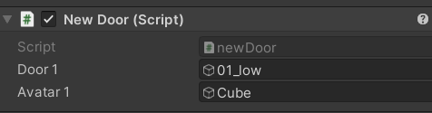

### [두 오브젝트 간 거리를 구하여 문과 캐릭터가 가까워졌을 때 문 열기]

이전 일지처럼 문 열기, 닫기, 고정 애니메이션을 문에 추가해두고 시작

1. 두 오브젝트 지정하기

   - 두 오브젝트를 담을 변수 두개를 선언

   - 유니티 개발 환경에서 해당 스크립트의 Inspector에 두 오브젝트를 지정함

     

     

     <br/>

2. 두 오브젝트의 좌표 구하기

   - object1.transform.position으로 좌표 (Vector3) 를 구할 수 있음
   - 두 변수에 각각의 위치 값을 저장

   <br/>

3. 두 오브젝트 간의 거리 구하기

   - (x1 - x2) ^2 + (y1 - y2) ^2 공식을 이용하여 구함

     - 상황에 따라 x값, y값이 아닌 z값을 이용할 수 있음

     <br/>

4. 문 열기

   - 문의 현재 상태를 구하는 bool 값을 지정
   - 문이 닫혀있고, 두 오브젝트의 거리가 기준값보다 작으면 (가까우면) 문 열림
   - 문이 열려있고, 두 오브젝트의 거리가 기준값보다 크면 (멀면) 문 닫힘
   - 두 상태에 해당하지 않으면 문이 닫힌 채로 정지인 상태 (우리 프로젝트 기준 door_idle)

   <br/>

<전체 스크립트>

```csharp
using System.Collections;
using System.Collections.Generic;
using UnityEngine;

public class newDoor : MonoBehaviour
{
    private Animator animator; // 애니메이터를 호출할 변수

    // 1. 거리를 구할 두 오브젝트 얻기
    public GameObject door1;
    public GameObject avatar1;
    float objectDistance;

    private bool doorOpen;

    void Start() // 시작
    {
        doorOpen = false; // 문 열리지 않은 상태로 초기화

        // 애니메이터 변수에 애니메이터 컴포넌트를 할당한다.
        animator = GetComponent<Animator>();
        Debug.Log("start");
    }

    void Update()
    {
        // 2. 각 오브젝트의 좌표 구하기
        Vector3 doorPos = door1.transform.position;
        Vector3 avatPos = avatar1.transform.position;

        // 3. 거리 계산
        float width = doorPos.x - avatPos.x;
        float height = doorPos.y - avatPos.y;

        float distance = width * width + height * height;
        distance = Mathf.Sqrt(distance);
        Debug.Log("거리: " + distance);

        if(distance <= 1 && !doorOpen)
        {
            Debug.Log("open");
            doorOpen = true;
            Doors("Open");
        }
        else if(distance > 1 && doorOpen)
        {
            Debug.Log("close");
            doorOpen = false;
            Doors("Close"); // Close 파라미터로 Trigger를 실행
        }
    }

    void Doors(string direction)
    {
        animator.SetTrigger(direction);
    }
}
```

<br/>

<br/>

<br/>

### 📖 Reference

- https://yenamobile.tistory.com/entry/Vector3Distance 
- https://euncero.tistory.com/402 
- https://m.blog.naver.com/oklmg/221006444538

