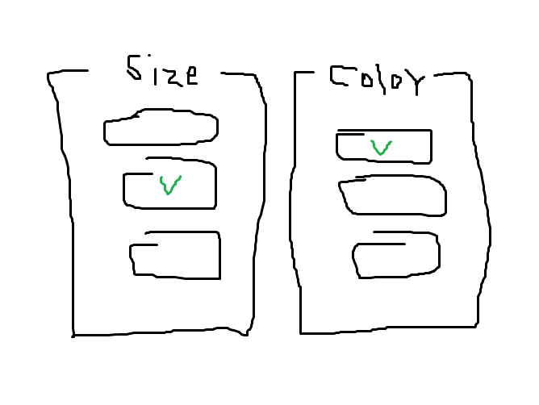

### [내가 원하는 기능]

- 각 그룹 마다 어떤 버튼이 눌렸는지 알고 싶다.
    
    
    
    - Size 그룹에서는 어떤 버튼이 눌렸는지, Color 그룹에서는 어떤 버튼이 눌렸는지
    
- 기존 코드 → 내가 어떤 사이즈를, 어떤 색을 선택했는지만 보임
- 원하는 코드 → Size 그룹에서 어떤 사이즈, Color 그룹에서 어떤 색을 선택했는지 보고 싶음
    - 버튼 Object의 부모를 구해서 어떤 그룹인지 알아오기

<

## 부모 오브젝트 구하기

- transform.parent.gameObject; 메소드 사용
    - 자식 또는 부모 객체 정보를 GameObject가 가지고 있다기 보다 GameObject의 컴포넌트인 Transform 객체가 가지고 있다.
    - Transform은 월드 좌표, 로컬 좌표를 관리한다.
    
    ```csharp
    // 클릭된 버튼의 부모 찾기
    public void ButtonClick(){
    	isClicked = true;
    	string name = this.gameObject.name;
    	Object parent = transform.parent.gameObject;
    	Debug.Log(name + "의 부모 객체는 " + parent);
    }
    ```
